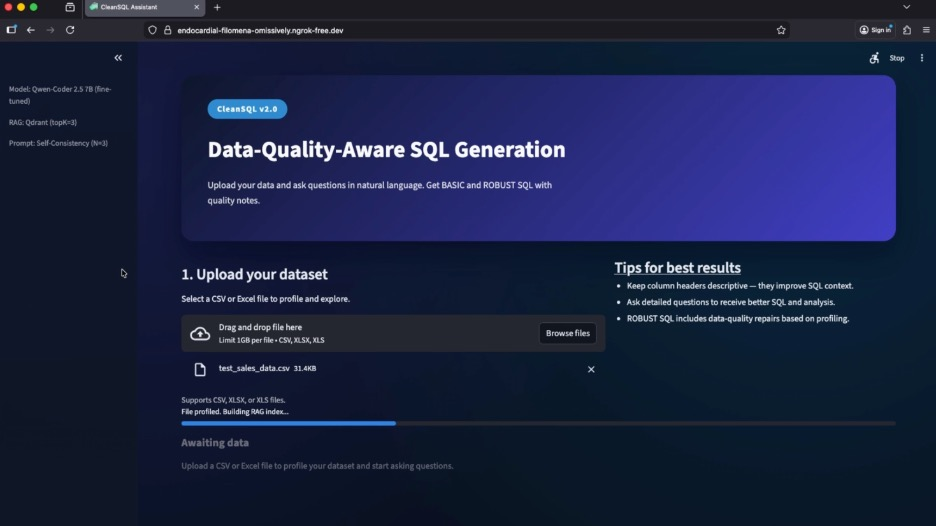
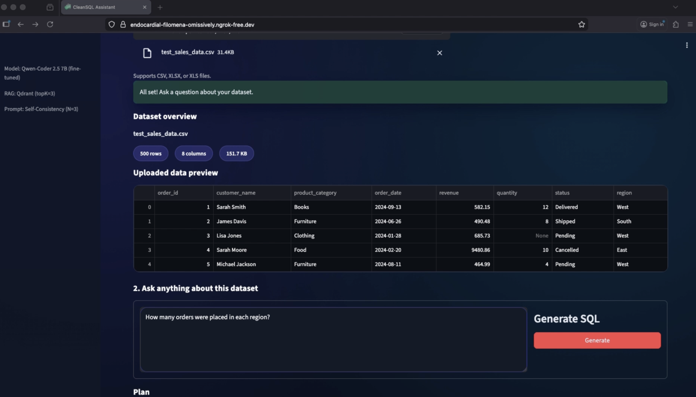
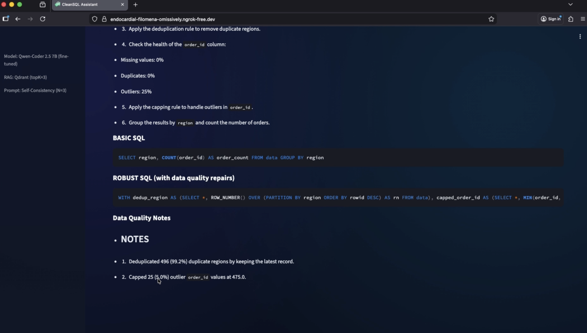

# CleanSQL

Data-Quality-Aware SQL Generation from Natural Language

## 🎥 Video Demo
🚀 **Watch the system handle messy data in real-time:** [CleanSQL Demo Video](./demo/CleanSQL_Demo.mp4)

## UI Walkthrough

Screens from the Streamlit demo — upload a dataset, ask a question in plain English, and get BASIC + ROBUST SQL with data-quality notes.

### Landing


### Query


### Results


## What is CleanSQL?

CleanSQL is a research project that tackles a real-world problem: generating SQL queries that actually work on messy, imperfect data. Most text-to-SQL systems assume your data is clean—but real datasets have missing values, outliers, duplicates, and inconsistencies.

CleanSQL generates two SQL variants for every question:
- **BASIC_SQL** — Standard query assuming clean data
- **ROBUST_SQL** — Smart query that handles data quality issues automatically

The project is split into two parts: the research pipeline (setup & training) and the demo application.

---

## Repository Structure

```
CleanSQL/
├── app/CleanSQL/                    # Demo application
└── setup_and_training/CleanSQL/     # Research pipeline
```

---

## Setup and Training (`setup_and_training/`)

This is where the research happens. I systematically evaluated different approaches to improve SQL generation quality, then fine-tuned a model using the best techniques.

### Stage 1: Prompt Engineering Evaluation

I tested five prompting strategies on the Spider benchmark to find what works best for SQL generation:

| Technique | Description |
|-----------|-------------|
| **Baseline** | Direct question → SQL generation |
| **Few-shot** | Include example question-SQL pairs |
| **Chain-of-Thought (CoT)** | Step-by-step reasoning before SQL |
| **Self-Consistency (SC)** | Generate multiple answers, pick the best |
| **Tree-of-Thought (ToT)** | Explore multiple reasoning paths |

Results are in `results/stage1_*.csv` with exact-match and execution-match metrics.

### Stage 2: RAG Evaluation

Once I identified the best prompting technique, I tested different RAG (Retrieval-Augmented Generation) configurations:

| Context Type | Description |
|--------------|-------------|
| **Schema Only** | Just table/column definitions |
| **RAG Top-K=3** | Retrieve 3 relevant profile chunks |
| **RAG Top-K=5** | Retrieve 5 relevant profile chunks |
| **RAG Top-K=8 + Rerank** | Retrieve 8, rerank to top 3 |

The RAG system uses Qdrant with hybrid search (dense + sparse vectors) and BAAI/bge-m3 embeddings. Profile chunks include schema info, data health metrics, value dictionaries, and SQL exemplars.

### Stage 3: LoRA/PEFT Fine-Tuning

Using the best prompt + RAG configuration, I fine-tuned Qwen2.5-Coder-7B-Instruct using QLoRA (4-bit quantization + Low-Rank Adaptation):

- **Base Model:** Qwen/Qwen2.5-Coder-7B-Instruct
- **Method:** QLoRA with r=8, alpha=16
- **Training Data:** ~500-1850 curated examples in chat format
- **Output:** LoRA adapter (~100MB vs 15GB full model)

Training data includes synthetic data-quality scenarios generated from Spider databases with injected corruptions (nulls, outliers, duplicates).

### Key Files

```
setup_and_training/CleanSQL/
├── cleansql/
│   ├── eval/           # Evaluation runners (stage1, stage2, metrics)
│   ├── llm/            # LLM client, prompts, PEFT trainer
│   ├── rag/            # Qdrant client, index builder, chunkers
│   └── profiling/      # Database profiling, corruption injection
├── scripts/            # Shell scripts to run experiments
├── data/               # Training data, Spider subset, profiles
├── results/            # CSV results from all experiments
└── work/               # Generated artifacts (indexes, checkpoints)
```

### Running the Pipeline

```bash
# 1. Build RAG index from Spider databases
./scripts/build_rag.sh

# 2. Run Stage 1 prompt engineering evaluation
./scripts/run_all_stage1.sh

# 3. Run Stage 2 RAG evaluation
./scripts/run_all_stage2.sh sc  # Using self-consistency

# 4. Fine-tune with LoRA
./scripts/peft_train.sh
```

---

## App (`app/CleanSQL/`)

The demo application deploys the fine-tuned model as a user-friendly Streamlit interface. Upload any CSV/Excel file, ask questions in plain English, and get data-quality-aware SQL.

### How It Works

1. **Upload CSV** → Automatic profiling (schema, nulls, outliers, duplicates)
2. **Build RAG Index** → Store profile chunks in Qdrant
3. **Ask Question** → Natural language query
4. **Get SQL** → BASIC + ROBUST variants with quality notes

### Features

- Self-consistency prompting (generates 3 samples, picks best)
- Hybrid RAG search (dense + sparse vectors)
- Real-time data profiling
- Quality notes explaining what fixes were applied

### Tech Stack

- **Frontend:** Streamlit
- **Inference:** vLLM (GPU) or llama.cpp (M1 Mac)
- **Vector DB:** Qdrant
- **Embeddings:** BAAI/bge-m3
- **Model:** Fine-tuned Qwen2.5-Coder-7B

### Quick Start

See `app/CleanSQL/SETUP.md` for detailed instructions:
- **Google Colab Pro** (recommended) — T4/A100 GPU, fast inference
- **M1/M2/M3 Mac** — Local development with llama.cpp

### Example Output

**Question:** "What's the average revenue by category?"

**BASIC_SQL:**
```sql
SELECT category, AVG(revenue) AS avg_revenue
FROM data GROUP BY category
```

**ROBUST_SQL:**
```sql
WITH capped AS (
  SELECT *, MIN(revenue, 120000.0) AS revenue_capped
  FROM data
)
SELECT category, AVG(revenue_capped) AS avg_revenue
FROM capped GROUP BY category
```

**Notes:** Capped 12 outliers at p95=$120,000

---

## Results

### Key Takeaway

The fine-tuned model achieves a **97% reduction in error rate** (MAPE: 10.22 → 0.33) while maintaining nearly the same literal accuracy (37% → 42%) and running **38% faster** (19.1s → 11.8s). This means the model produces significantly more accurate results on real-world messy data without sacrificing speed or correctness.

### Prompting Strategies (on corrupted Spider subset)

Self-Consistency achieved the lowest error rate (MAPE 0.46) while maintaining good literal accuracy:

| Technique | Robustness @1% | Robustness @5% | MAPE | Literal Match |
|-----------|----------------|----------------|------|---------------|
| Baseline | 68.91% | 70.19% | 86.30 | 34.26% |
| CoT | 62.73% | 63.66% | 10.07 | 36.75% |
| Few-Shot | 60.00% | 61.45% | 11.80 | 46.18% |
| **Self-Consistency** | 59.32% | 59.70% | **0.46** | 41.48% |
| ToT | 56.91% | 58.55% | 88.84 | 38.45% |

### RAG Configurations (with Self-Consistency)

RAG Top-k=3 gave the best balance of accuracy and low error:

| Configuration | Literal Accuracy | Robustness @1% | MAPE |
|---------------|------------------|----------------|------|
| No RAG (Baseline) | 43.84% | 94.93% | 22.91 |
| **RAG Top-k=3 + SC** | **44.29%** | 77.77% | **0.90** |
| RAG Top-k=5 + SC | 37.06% | 78.14% | 10.22 |
| RAG Top-k=8 Rerank + SC | 34.42% | 77.27% | 0.22 |

### Progressive Improvements

Each stage brought measurable gains:

| Metric | Baseline | + Self-Consistency | + RAG (Top-k=3) | + Fine-Tuning |
|--------|----------|-------------------|-----------------|---------------|
| MAPE (lower is better) | 10.22 | 0.46 | 0.90 | **0.33** |
| Literal Accuracy | 37.06% | 41.48% | 44.29% | 42.47% |
| Robustness @5% | 79.74% | 59.70% | 77.17% | 72.95% |

### Fine-Tuning Impact

Fine-tuning on just 500 examples improved both accuracy and speed:

| Metric | Baseline | Fine-Tuned (500 examples) |
|--------|----------|---------------------------|
| MAPE | 10.22 | **0.33** |
| Literal Accuracy | 37.06% | **42.47%** |
| Mean Latency | 19.1s | **11.8s** (38% faster) |
| DQ Note Coverage | 100% | 100% |

The fine-tuned model handles data quality issues more reliably while being quicker to respond—exactly what you need for real-world messy datasets.

*(Full results in `setup_and_training/CleanSQL/results/`)*

---

## Author

Built by Shatayu Thakur

## License

MIT License

---

Built with Qwen • vLLM • Qdrant • Streamlit • PEFT
