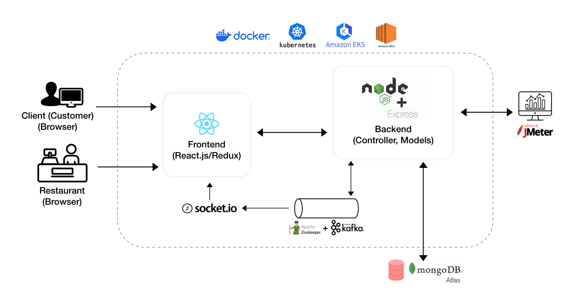

# 🍔 UberEats Full-Stack Clone

A production-ready food delivery platform built with the MERN stack, featuring real-time tracking, distributed task handling with Kafka, and a high-performance cloud deployment.

## ✨ Product Overview
This project is more than just a clone; it's a deep-dive into building **highly user-centric intelligent solutions**. It features a dual-portal ecosystem for Customers and Restaurant Owners, designed with a focus on intuitive UI/UX and seamless real-time interactions.

### 🍱 Customer Experience
Designed for speed and clarity, the customer journey focuses on effortless discovery and conversion.
- **Intuitive Discovery**: Browse restaurants with high-quality visual menus and real-time availability.
- **Seamless Cart Management**: A streamlined checkout process with multiple saved addresses.
- **Live Order Tracking**: Real-time status updates powered by WebSockets.

### 📊 Restaurant Management
A robust dashboard for business owners to manage operations with data-driven insights.
- **Dynamic Menu Control**: Real-time updates to dishes, pricing, and availability.
- **Performance Analytics**: Visual tracking of order volume and business health.
- **Real-time Order Fulfullment**: Instant notifications for new orders via Kafka & Socket.IO.

---

## 🎨 UI Walkthrough

### 🛍️ The Customer Journey
| Home & Discovery | Restaurant Menus |
| :---: | :---: |
|  |  |
| **Checkout & Cart** | **Order Tracking** |
|  |  |

### 📈 Restaurant Operations
| Business Dashboard | Performance Analytics |
| :---: | :---: |
|  |  |

---

## 🏗️ System Architecture
The application is built on a distributed architecture designed to handle high concurrency and ensure sub-second responsiveness.

### 💻 Tech Stack
- **Frontend**: React.js, Redux, Bootstrap (Custom CSS for premium UI/UX).
- **Backend**: Node.js, Express.js, MongoDB Atlas (Mongoose).
- **Messaging**: Apache Kafka (Order decoupling).
- **Real-time**: Socket.IO (WebSockets).
- **Media**: Cloudinary (Image optimization & storage).
- **Deployment**: Amazon EKS (Kubernetes), Docker.
- **Testing**: Apache JMeter (Load & Stress Testing).

---

## 🛠️ Key Technical Highlights
- **Distributed Order Processing**: Used Kafka to decouple order placement from notification services, ensuring the system remains responsive during peak loads.
- **Real-time Synchronization**: Implemented WebSockets to provide instant feedback to both customers and restaurant owners without manual refreshes.
- **Cloud Native**: Fully containerized using Docker and orchestrated via Kubernetes on AWS EKS for horizontal scalability.
- **Product-First Design**: Every interaction was stress-tested for friction, ensuring a user-centric experience that feels like a premium consumer app.

---

## 📬 Contact
**Shatayu Thakur**
[shatayuthakur12@gmail.com](mailto:shatayuthakur12@gmail.com) | [Portfolio](https://shatayuthakur.xyz)