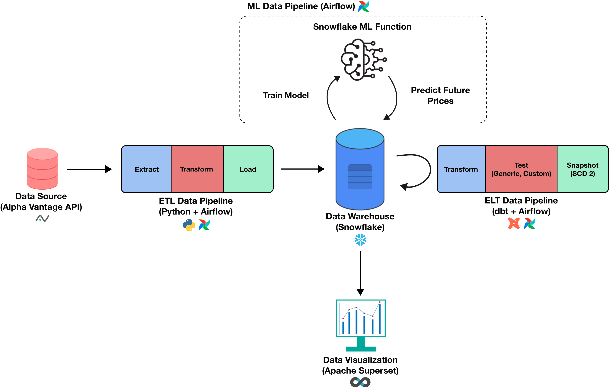
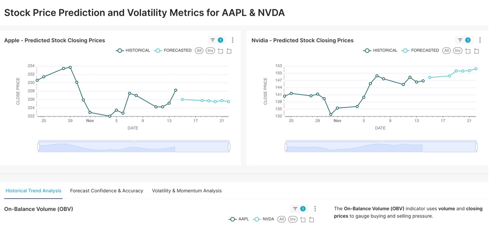
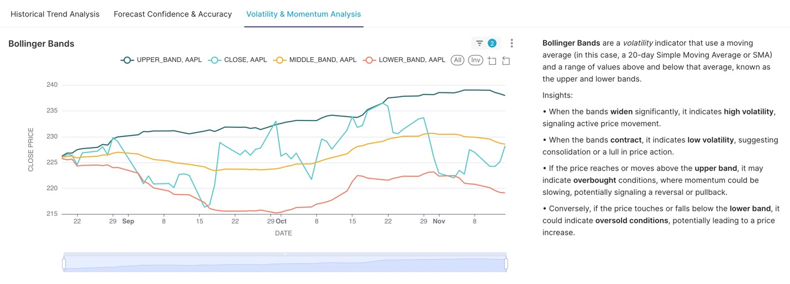
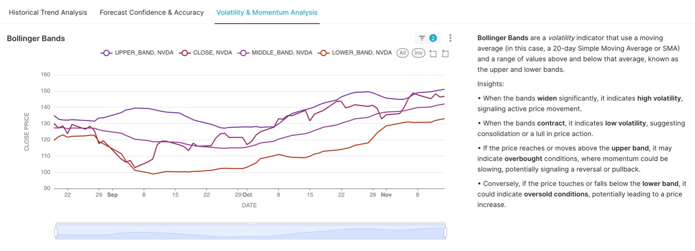
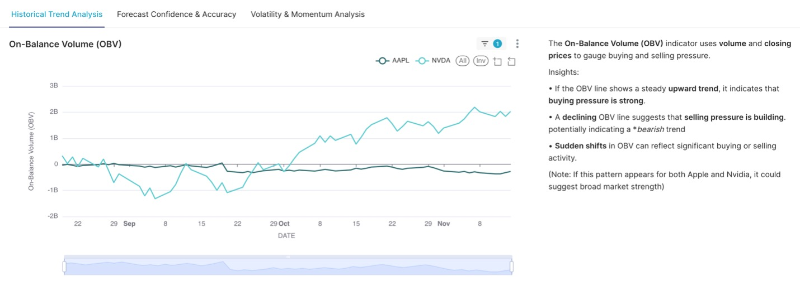
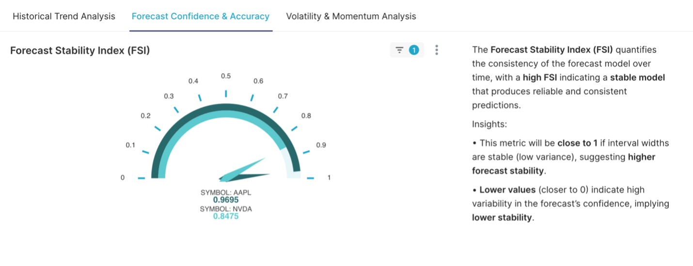

# 📈 Finance Data Analytics: End-to-End Stock Market Intelligence

An automated, production-grade data engineering pipeline that extracts stock market data, performs complex technical analysis, generates ML-based price forecasts, and visualizes insights in real-time.



## 🚀 Overview
This project implements a comprehensive financial data platform designed to track and predict stock performance (focusing on AAPL and NVDA). It leverages a modern data stack (MDS) to move data from raw API ingestion to actionable technical indicators and machine learning forecasts.

## 🏗️ Technical Architecture

### 1. Data Orchestration (Apache Airflow)
*   **ETL Pipeline**: Automated daily extraction from **Alpha Vantage API** for stock prices and volume.
*   **ML Pipeline**: Triggers Snowflake's native ML forecasting functions upon successful data load.
*   **ELT Pipeline**: Orchestrates **dbt** transformations to compute technical indicators.
*   **Monitoring**: Integrated Slack notifications for real-time success/failure alerts.

### 2. Data Warehousing & ML (Snowflake)
*   **Snowflake Cortex**: Utilizes `SNOWFLAKE.ML.FORECAST` for generating 7-day price predictions with a 95% confidence interval.
*   **Idempotent Loading**: Uses `MERGE` operations to ensure data integrity and prevent duplicates.

### 3. Analytics Engineering (dbt)
*   **Technical Indicators**: Custom dbt models for:
    *   **Bollinger Bands**: Measuring market volatility and overbought/oversold conditions.
    *   **On-Balance Volume (OBV)**: Tracking cumulative money flow to predict price movements.
    *   **Financial Stability Index (FSI)**: A custom metric derived from forecast interval stability.
*   **Data Governance**: Implements dbt tests and snapshots for historical tracking.

### 4. Business Intelligence (Apache Superset)
*   Dynamic dashboards visualizing historical trends vs. ML forecasts.
*   Real-time monitoring of technical indicators.

---

## 📊 Visual Walkthrough

### 🖥️ Analytics Dashboard
Comprehensive view of stock performance, comparing historical data with ML-generated forecasts.


### 📈 Technical Analysis
Detailed breakdown of market momentum, volatility, and stability indicators.

#### Bollinger Bands (Volatility)
|  |  |
| :---: | :---: |

#### Market Momentum & Stability
| On-Balance Volume (OBV) | Financial Stability Index (FSI) |
| :---: | :---: |
|  |  |

---

## 🛠️ Project Structure
```text
Finance_Data_Analytics/
├── airflow/               # Airflow DAGs for ETL, ML, and dbt orchestration
│   └── dags/
│       ├── FinanceDataAnalytics_ETL.py
│       ├── FinanceDataAnalytics_Prediction.py
│       └── FinanceDataAnalytics_ELT.py
├── dbt_fda/               # dbt project for data modeling
│   └── models/
│       ├── input/         # Staging/Raw views
│       └── output/        # Technical indicator models (Bollinger, OBV, FSI)
├── superset/              # Visualization configurations
└── docs/                  # System diagrams and screenshots
```

## ⚙️ Setup & Configuration

### Airflow Variables
The following variables must be configured in Airflow:
- `vantage_api_key`: API key for Alpha Vantage.
- `snowflake_conn`: Snowflake connection details.
- `SLACK_WEBHOOK_URL`: For pipeline notifications.

### dbt Profiles
Ensure your `profiles.yml` is configured to connect to your Snowflake `dev` database.

---
**Author**: Shatayu Thakur
**Contact**: [shatayuthakur12@gmail.com](mailto:shatayuthakur12@gmail.com)
