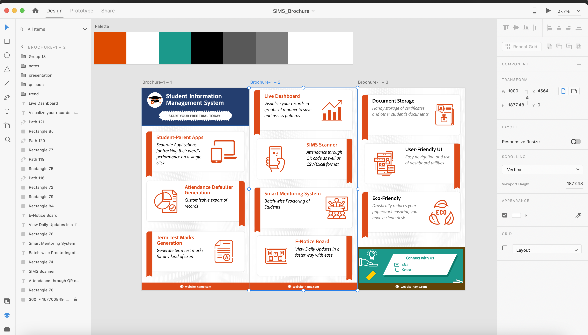
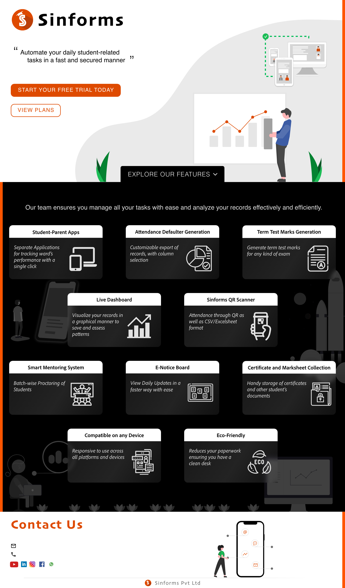
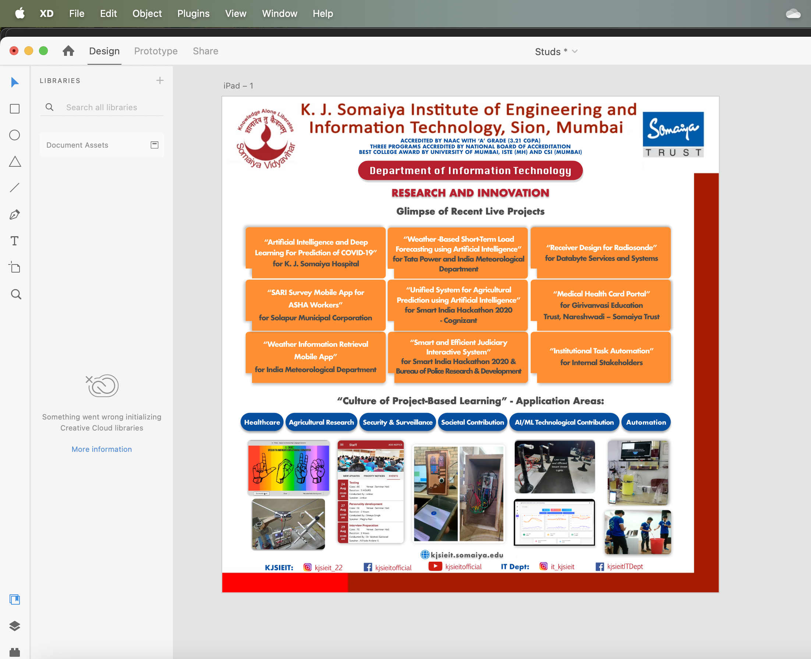

# Product & UX

This section documents how I approach **product thinking and user-centric design** — not as a separate discipline from engineering, but as part of how I decide what to build and whether it works for real people.

The work here falls into three buckets:

| Section | What it shows | Best for viewers who care about… |
| :--- | :--- | :--- |
| [Highlight Reel](#highlight-reel) | Breadth of product exploration across platforms | Quick scan — versatility and visual craft |
| [Interaction Prototypes](#interaction-prototypes) | Redesign thinking on real consumer/product flows | User empathy, usability, iteration before code |
| [Visual Communication](#visual-communication) | Static assets for outreach and messaging | Early-stage teams that need clear external communication |

For shipped, production UI tied to real systems, see the [UberEats platform walkthrough](../Distributed_EventDriven_Platform#-ui-walkthrough).

---

## Tools

All work in this folder was created in **Adobe XD** (interaction prototypes, screen flows, clickable concepts) and **Adobe Illustrator** (marketing layouts, typography, and visual assets). Screen recordings were exported from XD to demonstrate motion and state changes.

---

## Highlight Reel

**File**: [`highlight-reel.mp4`](./highlight-reel.mp4) (~5.5 MB)

A condensed walkthrough of product exploration work — interaction prototypes and visual concepts across e-commerce and desktop environments. Useful if you want a 1–2 minute overview before diving into individual pieces.

[🎥 Watch highlight reel](./highlight-reel.mp4)

---

## Interaction Prototypes

Screen recordings exported from **Adobe XD**. Each piece starts from a real product surface, identifies a user friction point, and explores a clearer interaction model. These are **concept explorations**, not production implementations — the goal is to show how I reason about usability before writing code.

### Amazon — Dark Theme Exploration
**File**: [`prototypes/amazon-dark-theme.mp4`](./prototypes/amazon-dark-theme.mp4)

| | |
| :--- | :--- |
| **Surface** | E-commerce product browsing (Amazon-style flow) |
| **User problem** | Bright UIs cause eye strain during long browsing sessions, especially at night — but dark modes often hurt scannability and trust if done poorly |
| **Product goal** | Adapt a high-traffic shopping flow to low-light contexts without hiding hierarchy, pricing, or primary CTAs |
| **What I explored** | Contrast balance, card legibility, and navigation affordances in a dark palette |

[🎥 Watch prototype](./prototypes/amazon-dark-theme.mp4)

### Amazon — Filter Redesign
**File**: [`prototypes/amazon-filter-redesign.mp4`](./prototypes/amazon-filter-redesign.mp4)

| | |
| :--- | :--- |
| **Surface** | Product search and filtering |
| **User problem** | Dense filter panels slow decision-making; users lose context switching between filters and results |
| **Product goal** | Reduce steps from search intent → relevant results |
| **What I explored** | Filter grouping, progressive disclosure, and layout that keeps results visible while refining |

[🎥 Watch prototype](./prototypes/amazon-filter-redesign.mp4)

### Windows — Default Window Behavior
**File**: [`prototypes/windows-default-window.mp4`](./prototypes/windows-default-window.mp4)

| | |
| :--- | :--- |
| **Surface** | Desktop OS window management |
| **User problem** | Default window sizing and placement shape first-use experience; small friction compounds across daily workflows |
| **Product goal** | Improve predictability and efficiency for common window interactions |
| **What I explored** | Default dimensions, snap behavior, and how the system communicates available window states |

[🎥 Watch prototype](./prototypes/windows-default-window.mp4)

---

## Visual Communication

**Files**: [`marketing/`](./marketing/) — brochure, email poster, event poster

Static collateral built in **Adobe Illustrator** for clear visual storytelling — brochures, email campaigns, and event posters. This is **supplementary** to the interaction work above: it shows I can translate product ideas into polished external-facing materials, which matters at early-stage startups where engineers often wear multiple hats.

> **Note for reviewers**: If you're hiring for SWE/AI, prioritize the [interaction prototypes](#interaction-prototypes) and [shipped UI work](../Distributed_EventDriven_Platform#-ui-walkthrough) — those are the strongest signals for product-minded engineering. This section is here for completeness.

| Asset | File | Context |
| :--- | :--- | :--- |
| Brochure | [`brochure.png`](./marketing/brochure.png) | Multi-panel layout for structured product/event messaging |
| Email campaign | [`email-poster.jpg`](./marketing/email-poster.jpg) | Single-focus visual for email and digital outreach |
| Event poster | [`poster.png`](./marketing/poster.png) | High-impact poster for event promotion and awareness |

| Brochure | Email Campaign | Event Poster |
| :---: | :---: | :---: |
|  |  |  |

---

## How This Connects to My Engineering Work

| Engineering project | Product/UX connection |
| :--- | :--- |
| [Distributed Event-Driven Platform](../Distributed_EventDriven_Platform) | Full customer + restaurant UI shipped in React — discovery, cart, checkout, live tracking |
| [AgenticAI AutoBot](../AgenticAI_AutoBot) | Built around real developer workflows: triage, alerts, and actionable output — not raw model dumps |
| [AI CleanSQL](../AI_CleanSQL) | Makes complex data-quality problems approachable through a usable query interface |

---

[← Back to Portfolio](../)
